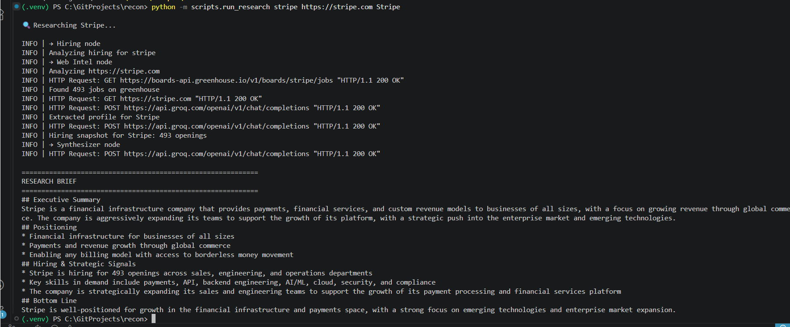
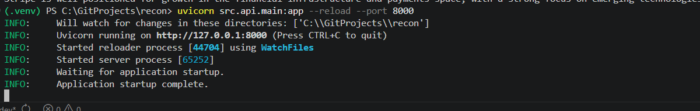

<div align="center">

# 🛰️ Recon

**Autonomous research agent platform** — competitive intelligence delivered to Slack in under 60 seconds.

[](https://www.python.org/)
[](https://langchain-ai.github.io/langgraph/)
[](https://www.pinecone.io/)
[](https://groq.com/)
[](https://fastapi.tiangolo.com/)
[](https://opensource.org/licenses/MIT)

</div>

---

## What it does

Send Recon a company name through REST, CLI, or (soon) Slack — it autonomously fetches data from web sources and public APIs, runs specialist agents in parallel, and returns a structured Markdown research brief.

> **"Tell me about Stripe"** → 45 seconds later → executive summary, positioning, hiring signals, and bottom-line analysis backed by real data.

## Demo

### Research brief output


### REST API with auto-generated docs


## Architecture
┌─────────────────┐
                │   USER QUERY    │
                │  (CLI/REST/Slack)│
                └────────┬────────┘
                         ▼
            ┌────────────────────────┐
            │  LangGraph Orchestrator │
            │   (parallel fan-out)    │
            └────┬──────────────┬─────┘
                 │              │
    ┌────────────▼─┐      ┌─────▼──────────┐
    │  Web Intel   │      │   Hiring       │
    │   Agent      │      │   Signals      │
    │  (homepage)  │      │  (job boards)  │
    └────────┬─────┘      └────────┬───────┘
             │                     │
             └──────────┬──────────┘
                        ▼
            ┌───────────────────────┐
            │   Synthesizer Agent    │
            │  (research brief)      │
            └───────────┬───────────┘
                        ▼
              ┌─────────────────┐
              │  Markdown Brief  │
              └─────────────────┘
   ## Key technical decisions

- **LangGraph over plain LangChain agents** — explicit state machine enables true parallel execution and is debuggable
- **Pydantic-validated structured outputs** — every LLM response is forced into a typed contract, validation failures are visible bugs not silent corruption
- **Vector store abstraction (Protocol pattern)** — Pinecone in production, Qdrant available for local; one config flag switches them
- **Groq + Llama 3.3 70B** — sub-second LLM latency at zero cost; quality competitive with frontier models for this workload

## Tech stack

| Layer | Choice |
|---|---|
| Orchestration | LangGraph |
| LLM | Groq (Llama 3.3 70B Versatile) |
| Vector DB | Pinecone Serverless (Qdrant fallback) |
| Embeddings | Nomic Embed Text v1.5 (768-dim, local) |
| Validation | Pydantic v2 |
| HTTP fetch | httpx |
| HTML parsing | selectolax |
| REST API | FastAPI + Uvicorn |
| Hosting | Fly.io (bot) + Render (API) — coming soon |

## Project structure
     recon/
├── src/
│   ├── config.py              # Pydantic-validated settings
│   ├── llm.py                 # Groq client wrapper
│   ├── schemas.py             # Pydantic agent contracts
│   ├── agents/
│   │   ├── web_intel.py       # Agent #1 — homepage profiling
│   │   └── hiring.py          # Agent #2 — job board analysis
│   ├── core/
│   │   ├── vector_store.py    # Protocol + Pinecone + Qdrant
│   │   └── chunking.py        # Sentence-aware text splitter
│   ├── orchestrator/
│   │   └── graph.py           # LangGraph parallel fan-out
│   └── api/
│       └── main.py            # FastAPI REST interface
├── scripts/                   # CLI runners for each agent
├── tests/fixtures/            # Indexed sample profiles
└── docs/index.html            # Project dossier (open in browser)
      ## Quick start

```bash
# Clone and enter
git clone https://github.com/richamathur-flex/recon.git
cd recon

# Setup environment
python -m venv .venv
.venv\Scripts\Activate.ps1     # Windows
# source .venv/bin/activate    # macOS/Linux
pip install -r requirements.txt

# Configure
cp .env.template .env
# Edit .env and add your GROQ_API_KEY and PINECONE_API_KEY

# Verify pipeline
python -m scripts.smoke_test

# Run an agent
python -m scripts.run_web_intel https://linear.app Linear
python -m scripts.run_hiring stripe Stripe

# Run the full research pipeline
python -m scripts.run_research stripe https://stripe.com Stripe

# Start the REST API
uvicorn src.api.main:app --reload --port 8000
# Open http://localhost:8000/docs
```

## API endpoints

| Method | Path | Description |
|---|---|---|
| `GET` | `/health` | Health check |
| `GET` | `/profile/{url}` | Run Web Intelligence agent only |
| `GET` | `/hiring/{slug}` | Run Hiring Signals agent only |
| `POST` | `/research` | Run full multi-agent pipeline |

## Verified on

The Web Intelligence agent has been validated against:
- Linear · Notion · Stripe · Supabase · Airtable · Figma · Vercel

The Hiring Signals agent has been validated against:
- Stripe (493 openings) · Brex (249 openings) · Vercel · Notion

## Roadmap

- [x] Day 1 — Project foundation, Pinecone + Groq smoke test
- [x] Day 2 — Web Intelligence Agent
- [x] Day 3 — Vector store abstraction, Hiring agent, LangGraph, FastAPI
- [ ] Day 4 — README polish + Slack bot
- [ ] Day 5 — Cloud deployment (Fly.io + Render)
- [ ] Day 6 — Tests + GitHub Actions CI
- [ ] Day 7 — RAGAS evaluation suite
- [ ] Day 8+ — Pricing agent, Sentiment agent, equity research vertical

## Documentation

The full project dossier — including architecture decisions, agent design philosophy, and learning journey — lives at [`docs/index.html`](docs/index.html).

## Author

**Richa Mathur** — [GitHub](https://github.com/richamathur-flex)

## License
